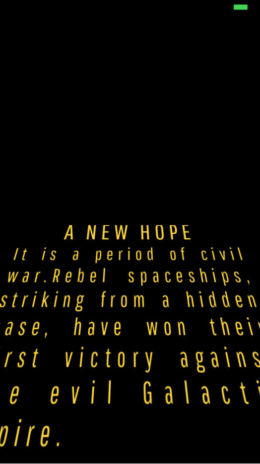

# react-native-star-wars
> A Star Wars Crawl Text Opening made by react native
> This currently only works on iOS.

## Installation

```sh
npm i react-native-star-wars
```

## Demo

Gif demo looks weird, Video demo is better.



video demo

[](https://www.youtube.com/watch?v=-SdtwGEwzIA)

### Code Example

```jsx
import React from 'react';
import StarWars from 'react-native-star-wars';

export default class App extends React.Component {
  render() {
    return (
      <StarWars
        title = "Hello World"
        content = "Ut velit aute nulla amet aliqua eu. Qui et non duis nisi adipisicing ad incididunt cillum Lorem cupidatat. Eu pariatur aliqua culpa esse excepteur sint ad laborum sint eiusmod laboris nulla ullamco. Aliqua voluptate ipsum elit et culpa ea culpa duis deserunt duis aute aliqua. Ea Lorem qui proident ut officia est anim adipisicing do in irure aliqua anim. Consequat quis aute anim velit."
      />
    );
  }
}
```

## API
| Name        			    | Type     | Default  | Description |
|:-------------------------|:---------|:---------|:---------|:------------|
| title | String | A NEW HOPE | Header Title for the star war crawler|
| titleStyle | Object | {} | Allow to override the style of the title | 
| content | String | It is a period of civil war.Rebel spaceships, striking from a hidden base, have won their first victory against the evil Galactic Empire.\nDuring the battle, Rebel spies managed to steal secret plans to the Empire\'s ultimate weapon, the DEATH STAR, an armored space station with enough power to destroy an entire planet.\nPursued by the Empire\'s sinister agents, Princess Leia races home aboard her starship, custodian of the stolen plans that can save her people and restore freedom to the galaxy..... | Content for the star war crawler|
| contentStyle | Object | {} | Allow to override the style of the content | 


## Contributions
Contributions are welcome. I'll be happy to merge any PR's.
